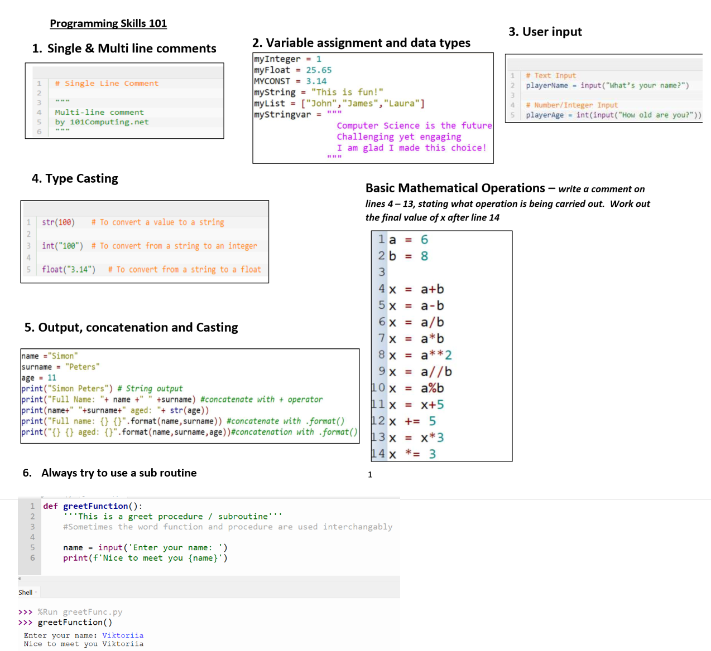
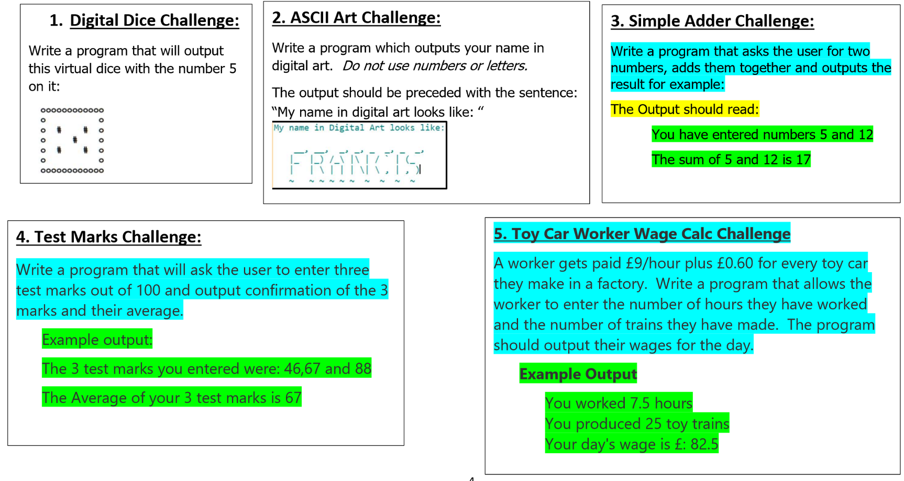
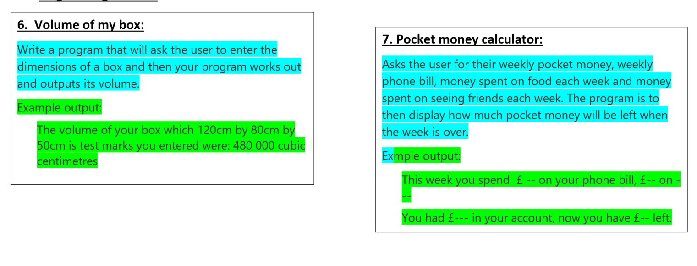
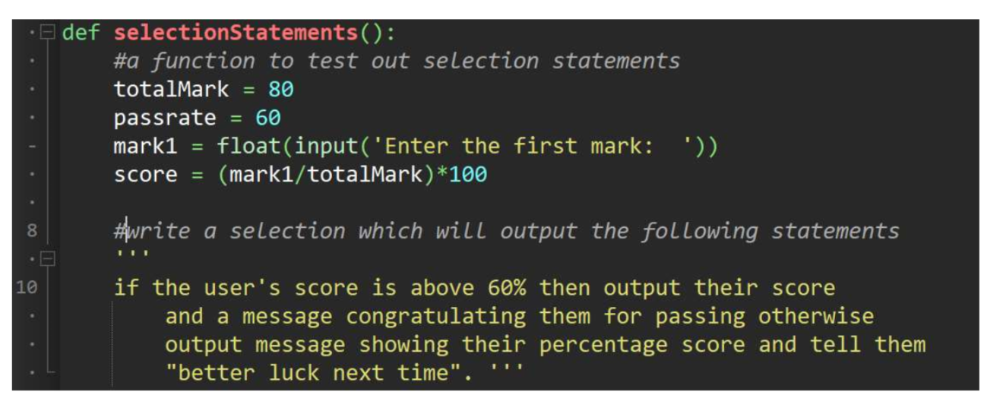
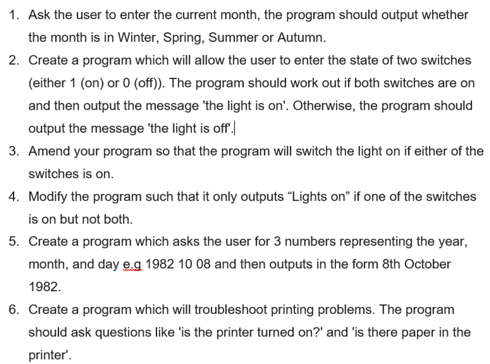

# Python Basics Tasks

### 1. Choosing the right IDE
NOTHING TO DO HERE - JUST READ!! You can use Visual Studio, to code this however for absolute beginners I recommend this IDE [Thonny](http://www.thonny.org)

# -------------------------- Tasks Start Here ----------------------------------
## 2. Basic Sequential Tasks

### Code the following tasks - try to put each solution in a function of its own

## 3. Selection Tasks - sometimes referred to as IF Statements

### code these tasks using if statements - advisable to put each solution in a function / procedure

